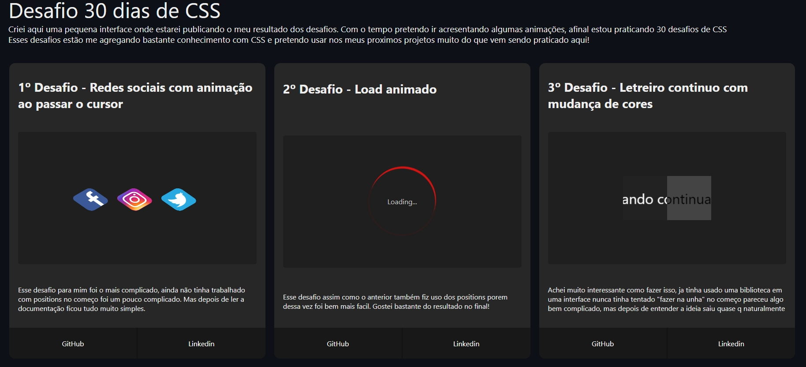

<h1 align="center">
Desafios de CSS
</h1>

<p align="center">Este projeto foi desenvolvido para fins de estudo, 
  o projeto consiste em uma interface(ainda em desenvolvimento) com diversos desafios CSS.</p>

<p align="center">
  
  <br/>
</p>

<p align="center">
  
<p>


## Aprendizado
O projeto foi criado inicialmente com intuito de praticar animações usando exclusivamente o CSS, porem com apos a criação dos primeiros desafios decidi criar toda a infraestrutura utilizando o React e Styled Components para assim tambem poder praticar todos em conjunto, maximizando ainda mais a absorção do aprendizado.


## Tecnologias Utilizadas

- [X] ReactJS
- [X] TypeScript
- [X] Styled Components
- [X] CSS


## :arrow_forward: Como executar

_com **npm**_

```bash
# Instalar dependências
$ npm install
# Iniciar servidor
$ npm start
```

_com **yarn**_

```bash
# Instalar dependências
$ yarn
# Iniciar servidor de desenvolvimento
$ yarn start
```
